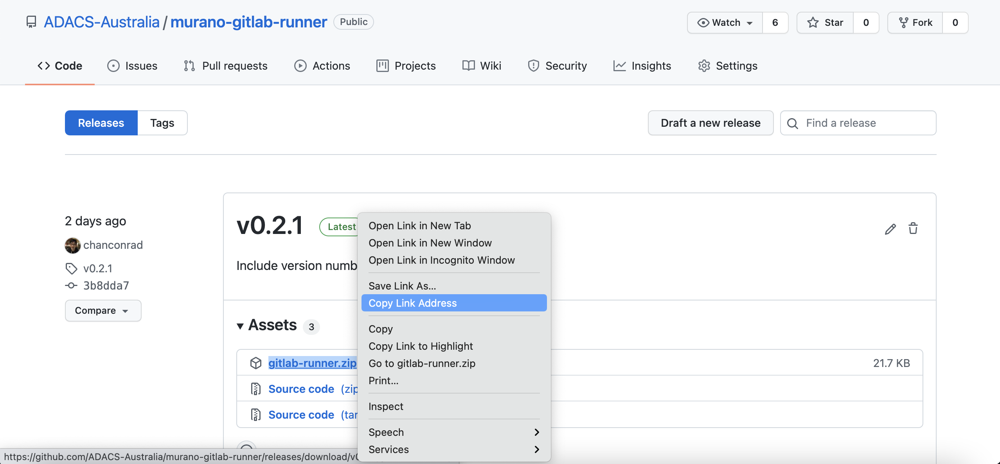
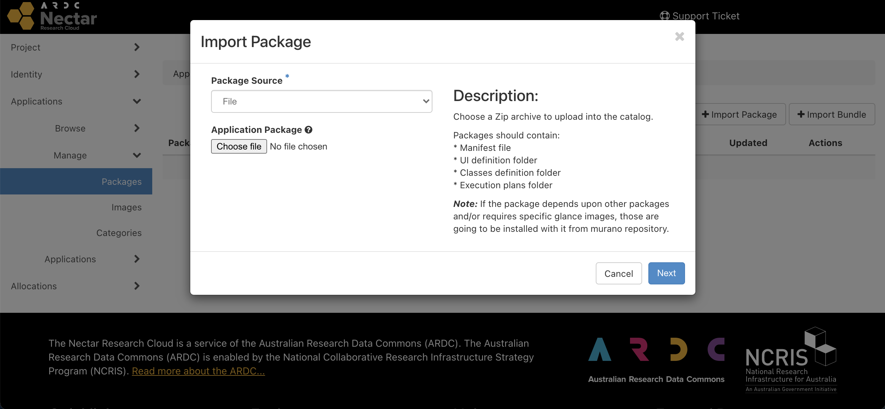
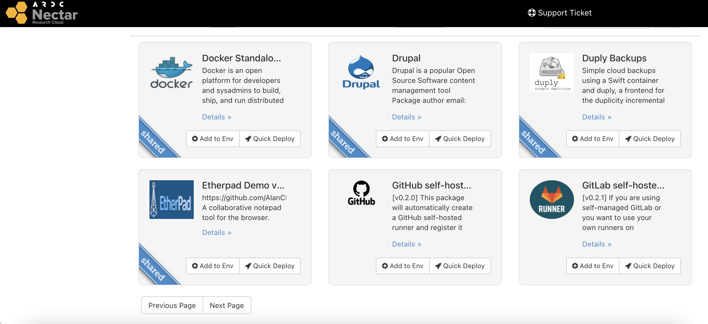
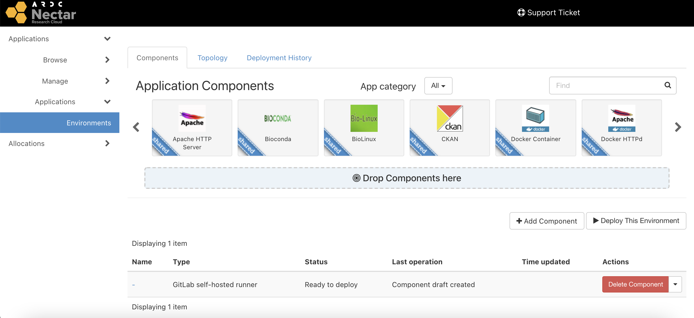

# Custom ADACS Apps
It is also possible to build your own custom applications and upload them to the Nectar Application Catalogue. Below are some custom packages put together by the ADACS team that you can upload to your Nectar project.

## GitHub and GitLab self-hosted runners
GitHub and GitLab allow users to host their own runners for running Continuous Integration and Continuos Deployment (CI/CD) workflows. This might be useful if you require a custom environment to run your jobs, or if you need more computational resources than what the native runners provide.

Setting up your own runner on the Nectar Cloud and registering them with GitHub or GitLab is fairly straightforward to do manually, but we've create some packages that will automate the process for you.

### Upload
To be able to use the apps, you'll need to upload them your Nectar Application Catalogue. The applications are packaged in zip archives, which you can find on the releases pages of our GitHub and GitLab self-hosted runner apps:

- <https://github.com/ADACS-Australia/murano-github-runner/releases>{target="_blank"}
- <https://github.com/ADACS-Australia/murano-gitlab-runner/releases>{target="_blank"}

Find the zip archive from the latest release, and copy its link address (you can do this by right clicking on it).

On your Nectar Dashboard, navigate to `Applications > Manage > Packages`.
From here you can upload, manage and delete custom apps. To upload a new application, select `+ Import Package`.
(Or click [here](https://dashboard.rc.nectar.org.au/app-catalog/packages/upload){target="_blank"}).

Then select URL as the source and paste the link address of the zip archive, and hit `Next`. You will then be able to modify the package name, tags and description if you wish to. Select `Next` to accept the defaults. You can then choose a category for your package. This is optional also, and only used for filtering apps in the catalogue. Press `Create` to finish uploading your application.

### Launch App
Once you have uploaded your package, it should become available in the application catalogue.

To launch your self-hosted runner, select quick-deploy, and fill out the relevant information in the forms.

You will require a registration token that you can find in your GitHub or GitLab repository settings.

- On GitHub, go to `Settings > Actions`, in the left sidebar, under `Actions`, click `Runners`, then click `New self-hosted runner`.
- On GitLab, go to `Settings > CI/CD` and expand the `Runners` section.

Once you've filled out all the forms and selected the flavour for your VM, your application will be added to an "environment" that you can deploy. It should look something like this:

Select `Deploy This Environment` to begin the automation procedure. This involves spinning up the virtual machine, installing the self-hosted runner software and registering the runner using the token provided. It may take a few minutes.

Once the procedure is complete, your self-hosted runner should appear in your GitHub or GitLab repository settings, and will be ready to receive jobs.

## The Littlest JupyterHub
*"A simple JupyterHub distribution for a small (0-100) number of users on a single server."*

This murano application installs and configures a server with [The Littlest JupyterHub](https://tljh.jupyter.org/en/latest/){target="_blank"}.

For more details see the [GitHub repository](https://github.com/ADACS-Australia/murano-jupyterhub){target="_blank"}.

### Upload
As with the self-hosted runners [above](#github-and-gitlab-self-hosted-runners), each release contains a `zip` file that can be uploaded to your Nectar/OpenStack account. You can upload a release directly using a URL.

On you Nectar/OpenStack account, navigate to [`Applications > Manage > Packages > Import Package`](https://dashboard.rc.nectar.org.au/app-catalog/packages/upload){target="_blank"}, and choose URL as the Package Source.
Copy and paste the following link address:

https://github.com/ADACS-Australia/murano-jupyterhub/releases/latest/download/jupyterhub.zip

Alternatively, go to the releases for this repo, and select your preferred release. Under assests, right click on `jupyterhub.zip` and then copy the link address.

## Destroying an app environment
You can destroy the application enviroment from `Application > Applications > Environments` page on your Nectar Dashboard.
This will destroy the VM and any other cloud resources associated with it (such as security groups) in one go. We recommend removing them in this way, rather than destroying each component manually, one-by-one.
