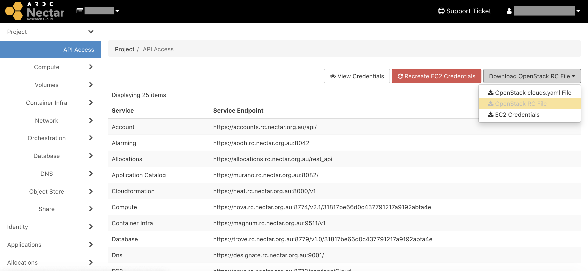
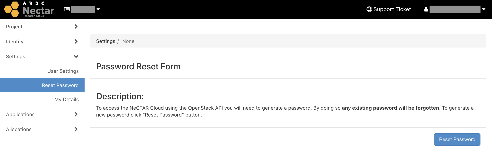
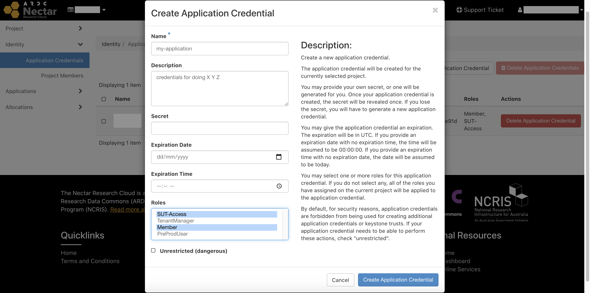

# OpenStack APIs and Command Line Interface
All of the functionality provided by the dashboard is also accessible through the OpenStack APIs (e.g.  launching instances, creating images, etc). They are useful for scripting/automating your cloud configuration and setup. Many cloud configuration and automation software packages already exist that make use of these APIs (e.g. Terraform, Packer) but even if you have no need for them, you may find the OpenStack Command Line Interface (CLI) useful and/or more powerful than the dashboard, which makes use of the OpenStack APIs.

## Credentials
To use the APIs you need to have the correct OpenStack credentials loaded into your environment. These are just a set of environment variables that describe the connection details required to authenticate with OpenStack/Nectar.

### User Credentials
Each user has their own set of credentials. You can download your credentials by going to `Project > API Access` then selecting `Download OpenStack RC File > OpenStack RC File`.



Alternatively, you can download your user credentials by clicking your username/email in the top right corner and selecting `OpenStack RC File`.


Either way, your browser will download your credentials as a shell script named e.g.`my-project-openrc.sh`. Its contents should look something like this

```bash
#!/usr/bin/env bash
# To use an OpenStack cloud you need to authenticate against the Identity
# service named keystone, which returns a **Token** and **Service Catalog**.
# The catalog contains the endpoints for all services the user/tenant has
# access to - such as Compute, Image Service, Identity, Object Storage, Block
# Storage, and Networking (code-named nova, glance, keystone, swift,
# cinder, and neutron).
#
# *NOTE*: Using the 3 *Identity API* does not necessarily mean any other
# OpenStack API is version 3. For example, your cloud provider may implement
# Image API v1.1, Block Storage API v2, and Compute API v2.0. OS_AUTH_URL is
# only for the Identity API served through keystone.
export OS_AUTH_URL=https://keystone.rc.nectar.org.au:5000/v3/
# With the addition of Keystone we have standardized on the term **project**
# as the entity that owns the resources.
export OS_PROJECT_ID=<your project ID>
export OS_PROJECT_NAME="my-project"
export OS_USER_DOMAIN_NAME="Default"
if [ -z "$OS_USER_DOMAIN_NAME" ]; then unset OS_USER_DOMAIN_NAME; fi
export OS_PROJECT_DOMAIN_ID="default"
if [ -z "$OS_PROJECT_DOMAIN_ID" ]; then unset OS_PROJECT_DOMAIN_ID; fi
# unset v2.0 items in case set
unset OS_TENANT_ID
unset OS_TENANT_NAME
# In addition to the owning entity (tenant), OpenStack stores the entity
# performing the action as the **user**.
export OS_USERNAME="your@email.edu.au"
# With Keystone you pass the keystone password.
echo "Please enter your OpenStack Password for project $OS_PROJECT_NAME as user $OS_USERNAME: "
read -sr OS_PASSWORD_INPUT
export OS_PASSWORD=$OS_PASSWORD_INPUT
# If your configuration has multiple regions, we set that information here.
# OS_REGION_NAME is optional and only valid in certain environments.
export OS_REGION_NAME="Melbourne"
# Don't leave a blank variable, unset it if it was empty
if [ -z "$OS_REGION_NAME" ]; then unset OS_REGION_NAME; fi
export OS_INTERFACE=public
```

Before you can use your credentials however, you will also need to generate a credentials password. **This is different from your user login password.**

Click your username/email in the top right corner and select `Settings` from the dropdown menu. Then select `Reset Password` on the left hand side menu to open the Password Rest Form.
To generate a new password click the `Rest Password` button.



!!! important
    Your credentials password will only appear once! Make sure you save it somewhere safe immediately. If you lose it, or forget it, you can always generate a new one.

To use your credentials, simply load the script into your environment and enter your credentials password when prompted.

```console
$ source ~/Download/my-project-openrc.sh
Please enter your OpenStack Password for project my-project as user your@email.edu.au:
```

If all went well, you won't see anything special. But you can check to see if any of the environment variables were set. For example,
```console
$ echo $OS_PROJECT_NAME
my-project
```

!!! tip
    You can edit your script so that `OS_PASSWORD` is hard-coded and you are not prompted each time you load your credentials.

### Application Credentials
Alternatively, you can also generate credentials suitable for applications to authenticate with the APIs, without having to expose your main/personal credentials. Application credentials can be easily revoked and recreated, they can have an automatic expiry, and they are more secure than user credentials since, by default, they do not allow certain actions to be performed (e.g. creating additional application credentials).

To generate an application credential, go to `Identity > Application Credentials` on the dashboard, then select `+ Create Application Credential`.



Give your credential a name, and select `Member` and `SUT-Access` (as a minumum) under Roles. The latter role is required for launching instances on the Swinburne availability zone. You may optionally also give your credential an expiry and choose its secret/password.

Press the `Create Application Credential` button, and then click `Download openrc file`. This will download your credentials into a script named e.g. `app-cred-my-application-openrc.sh`. Your secret/password will be hard-coded into the script. Its contents should look something like this
```bash
#!/usr/bin/env bash

export OS_AUTH_TYPE=v3applicationcredential
export OS_AUTH_URL=https://keystone.rc.nectar.org.au:5000/v3/
export OS_IDENTITY_API_VERSION=3
export OS_REGION_NAME="Melbourne"
export OS_INTERFACE=public
export OS_APPLICATION_CREDENTIAL_ID=<your application credential id>
export OS_APPLICATION_CREDENTIAL_SECRET=<your application credential secret>
```

You load your application credentials in the same manner as you would your user credentials
```console
$ source ~/Downloads/app-cred-my-application-openrc.sh
```

## OpenStack CLI (Python)
The OpenStack Command Line Interface gives you the power to do everything that you can in the dashboard via the terminal instead. It is written in Python, so you can install it via the Python Package Index (PyPI)
```console
$ pip install python-openstackclient
```
Next, load your credentials into your environment. You can use either your user credentials or application credentials.
```console
$ source my-project-openrc.sh
```
Now you can run `openstack` commands to view and manage your Nectar resources.

For example, to create an `m3.xsmall` VM from the official Nectar Centos 7 image
```console
$ openstack server create my_first_vm \
  --image "NeCTAR CentOS 7 x86_64"    \
  --flavor "m3.xsmall"                 \
  --security-group "SSH"              \
  --key-name "nectarkey"
```

To list all your current instances/VMs
```console
$ openstack server list
+--------------------------------------+-------------+--------+-------------------------------------+------------------------+-----------+
| ID                                   | Name        | Status | Networks                            | Image                  | Flavor    |
+--------------------------------------+-------------+--------+-------------------------------------+------------------------+-----------+
| 11977445-e189-4d0a-bbb0-3d0c181adca0 | my_first_vm | ACTIVE | swinburne-01-public=136.186.108.181 | NeCTAR CentOS 7 x86_64 | m3.small  |
+--------------------------------------+-------------+--------+-------------------------------------+------------------------+-----------+
```

To list all available commands
```console
$ openstack --help
```
To get a description of a specific command
```console
$ openstack help <command>
```

To get a complete list of all available options, visit the [OpenStack Client website](https://docs.openstack.org/python-openstackclient/latest/){target="_blank"}.
