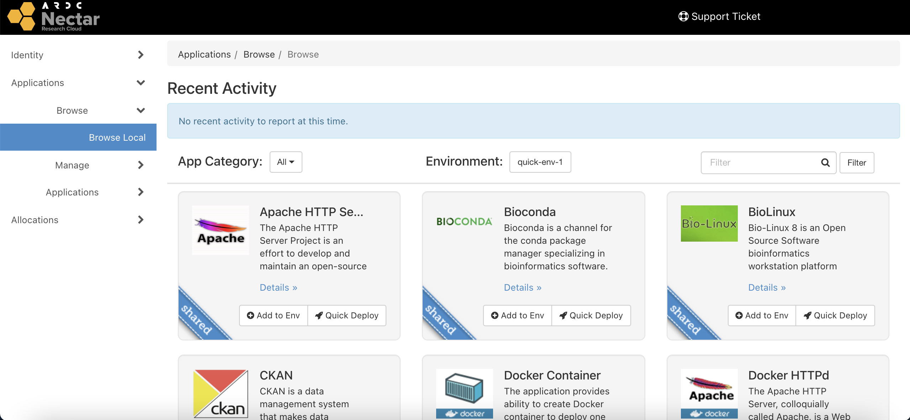

# Applications
Nectar provides a set of "cloud-ready" applications for quick and easy deployment, implemented using the [OpenStack Murano Project](https://wiki.openstack.org/wiki/Murano){target="_blank"}.

These application packages automate the deployment of cloud resources as well as the subsequent system administrations tasks that are required to setup a server, such as a Jupyter Notebook or an R-Studio server.

Instead of manually spinning-up a virtual machine, and then connecting to it to install and configure the software yourself, apps provide a simple user interface from which you can initiate the whole process.

You can find a guide for [launching an R-Studio server](https://tutorials.rc.nectar.org.au/applications/01-overview){target="_blank"} on the Nectar tutorials page. The steps for launching a Jupyer Notebook server are similar. Note that the R-Studio app also includes a Shiny server along with remote-desktop-based access via either your browser or X2Go.

Here is a full list of applications available in the **Application Catalogue** provided by Nectar:

- Apache HTTP Server
- Bioconda
- BioLinux
- CKAN
- Docker Container
- Docker HTTPd
- Docker Standalone Host
- Drupal
- Duply Backups
- Etherpad Demo
- GLAM Workbench
- Jupyter Notebook
- LAMP
- LAMP Base
- LimeSurvey
- MediaWiki
- Nectar Tutorials
- R-Studio
- Walma Demo
- WordPress

You can find them by navigating to [`Applications > Browse > Browse Local`](https://dashboard.rc.nectar.org.au/app-catalog/catalog/){target="_blank"} on your Nectar Dashboard.

