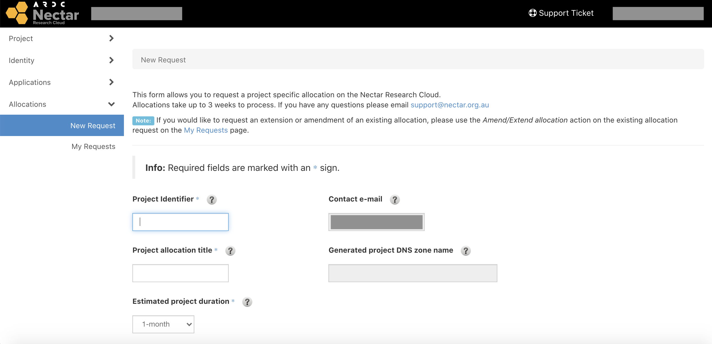
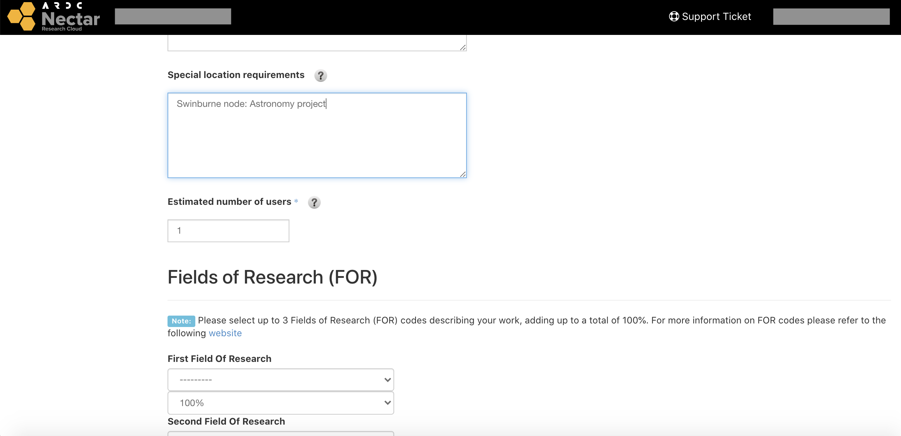
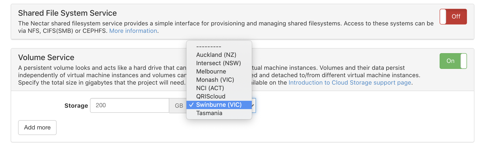
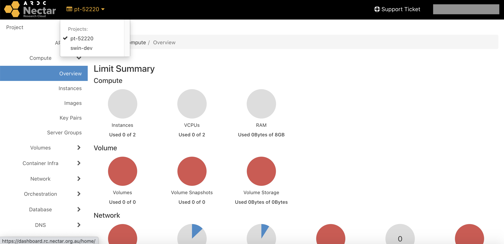

# Astronomy projects/applications

!!! note
    We highly recommend you familiarise yourself with [launching a simple VM](getting-started.md) inside a trial project **before** going through the application process.

## Applications
To apply for an astronomy project on the Swinburne zone, follow the same steps as when applying for a national allocation and make sure to mention **Swinburne** as your location requirement.

**To fast-track your application, we also request that you let us know you have submitted an application via email at <openstack@adacs.org.au>.**

Go to the dashboard and click the `Allocations` tab on the left panel, and then select `New Request`.

Complete all the compulsory fields as you would for a standard Nectar project, and select the resources/services you will require. For most people this will be `Compute` and `Volume` services.

Remember to mention **Swinburne** under the **'Special location requirements'** field.
Also make sure to select **Swinburne** as the location when requesting **Volume Storage**.

---

---

Remember to email us at <openstack@adacs.org.au> once you have submitted.
This is ensure that your application is correctly filtered out from standard national allocation requests.
Following your submission, a system administrator may be in touch with you to discuss your resource requirements. Applications are usually approved within a week of submission.

---

## Switching projects
You can change projects from the **dashboard** via the **dropdown menu** on the **top left**.
All projects that you are a member of will be listed here, including your trial project (unless you requested to convert it).

If you've been added to a project but don't see it in the list, try refreshing your page.
If you can switch projects but cannot launch new instances in that project, please contact [Nectar Support](https://support.ehelp.edu.au/){target="_blank"}.
