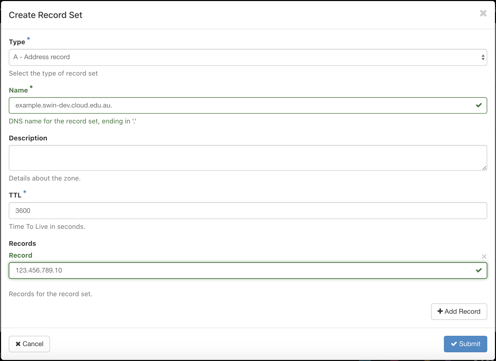

# Adding a domain name/DNS record
You can associate your instance with a *domain name* by creating a *DNS record*, which is easier to remember than an IP address.
Also, if the IP address of your instance happens to change (e.g. because you had to delete and relaunch the VM from the same image), you can simply update the DNS record **once** to point to the new IP address.
This is useful if you connect from multiple machines, or if you have given others access to your VM.

For new projects and projects with allocations being renewed, a Nectar provided *DNS zone* will be created automatically for your project to use. (Trial projects do NOT have one.) They are typically in the format `<project-name>.cloud.edu.au.`

You can find your DNS zone in the dashboard by navigating to `Project > DNS > Zones` in the sidebar. Then, to create a domain name for your instance, select `Create Record Set`.


- We will create a **Type A - Address** record, which points a domain name to a specific IPv4 address.
- The start of the **DNS name** is your choice, but it must end in the zone name (and make sure to include a trailing `.`). For example `example.swin-dev.cloud.edu.au.`
- Finally, add the **IP address** of your instance to the `Record` field.



After you hit `Submit`, your instance should be accessible via your chosen domain name. For example,

```console
ssh -i ~/.ssh/nectarkey.pem ubuntu@example.swin-dev.cloud.edu.au
```

Don't forget to update the `HostName` in your ssh config file(s)
```console
Host nectar
   HostName = example.swin-dev.cloud.edu.au
   User = ubuntu
   IdentityFile = ~/.ssh/nectarkey.pem
   ForwardX11 = yes
```

!!! info "See also"
    [https://tutorials.rc.nectar.org.au/dns-with-designate/01-overview](https://tutorials.rc.nectar.org.au/dns-with-designate/01-overview){target="_blank"}
     [https://support.ehelp.edu.au/support/solutions/articles/6000201311](https://support.ehelp.edu.au/support/solutions/articles/6000201311){target="_blank"}
