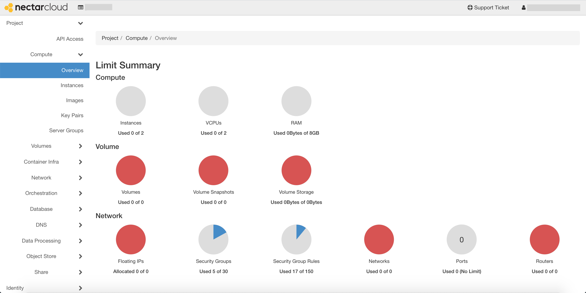

# Getting started

### Logging in
Wethere you want to create an account or just to log in, head to [https://dashboard.rc.nectar.org.au](https://dashboard.rc.nectar.org.au/){target="_blank"}.
All Australian researchers can log in with the Australian Access Federation (AAF).
Simply select your university or institution (e.g. Swinburne) and log in with your usual credentials. If you have not used the Nectar Research Cloud before, then **this will create an account for you**.

### The dashboard
Once you have logged in, you will be on the *Nectar Research Cloud Dashboard*. This is the first and easiest way to manage your VMs as well as allocation requests.

At this point you can continue with the guide using your trial project, or you can [apply](astronomy.md#applications) for a new one. If you have not used cloud services before, we recommend experimenting within your trial project before applying for more resources.

!!! hint
    If you're logging in for the very first time and don't see any resources available to you (like in the image above), you may have to **refresh your page**.

We will show you how to use the dashboard to launch a basic instance (Virtual Machine), and then we'll show you how to access the instance via SSH from your local machine. However, in order to access your virtual machine you will need to make sure it is set up with:

1.  a _**security group**_ that allows SSH connections; and
2.  an _**SSH key pair**_

So before launching an instance, make sure you have these items first. We'll show you how on the next page.

!!! info
    You can find more information about the dashboard at the [Nectar Research Cloud Dashboard support page](https://support.ehelp.edu.au/support/solutions/articles/6000076111-nectar-research-cloud-dashboard){target="_blank"}.
