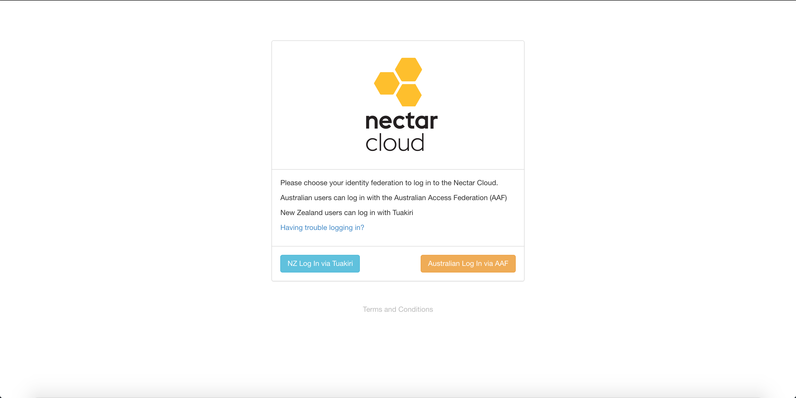
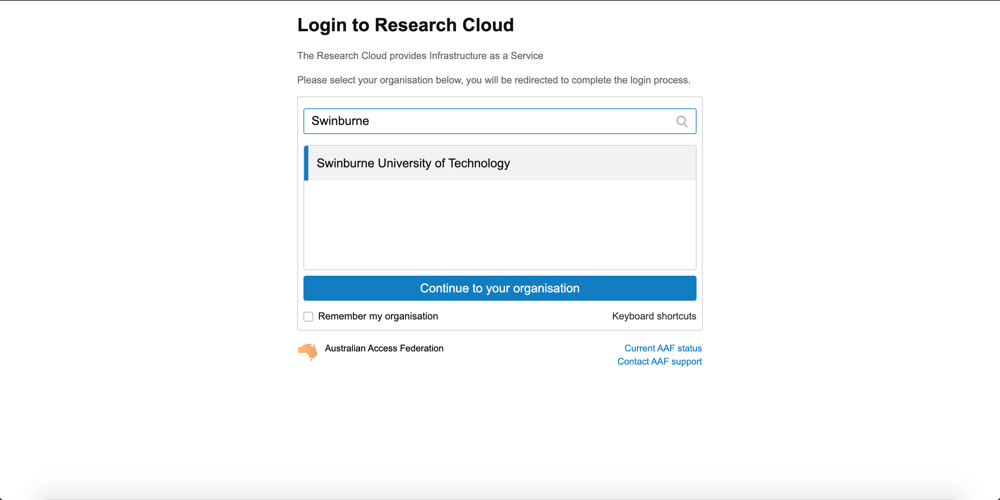

# Getting started

Head to [https://dashboard.rc.nectar.org.au](https://dashboard.rc.nectar.org.au/){target="_blank"}.
Australian researchers can log in with the Australian Access Federation (AAF).
Simply select your university or institution (e.g. Swinburne) and log in with your usual credentials. If you have not used Nectar/Swin-RC before, then this will create an account for you.

!!! info
    All researchers initially (and without applying for additional resources) get a project trial with 2 VCPUs (virtual CPUs) allocated for 3 months.
    This means you can run 1 Medium or 2 Small virtual machines for three months. Or 1 small VM for a total of 6 months.
    To get more resources, you need to join a project or apply for one.
