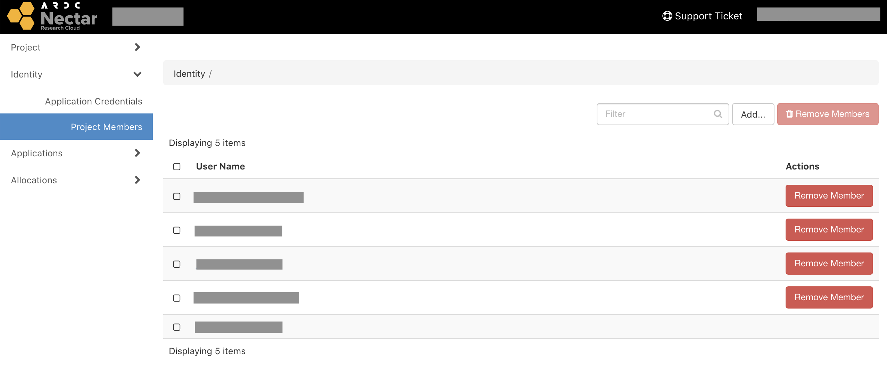

# Adding members
You can add other Nectar users to your project by going to `Identity > Project Members` on the dashboard, and then clicking `Add`. Enter the email address associated with their existing Nectar account.

Added users will be able to create/destroy instances and have access to all the resources allocated to the project, so only add people that you trust!

!!! warning
    When you are part of a project with multiple members, take care not to delete another member's VM.

If you've been added to a project by a collaborator you can [switch to that project](astronomy.md#switching-projects) in the dashboard.
