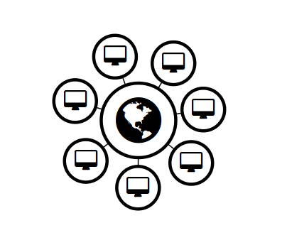
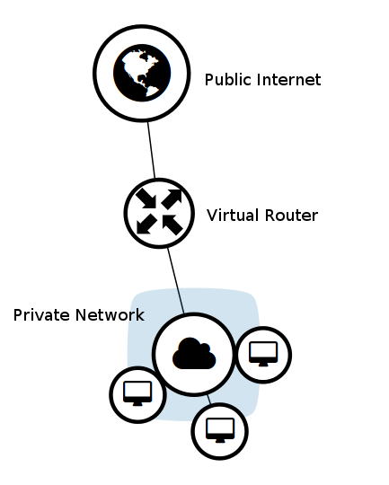
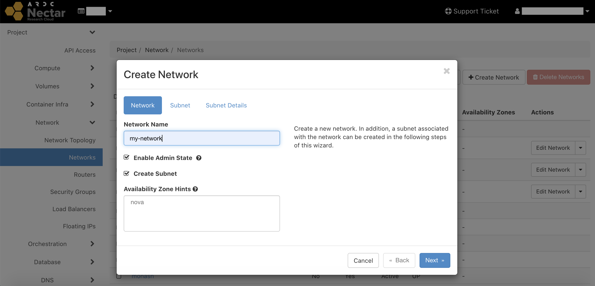
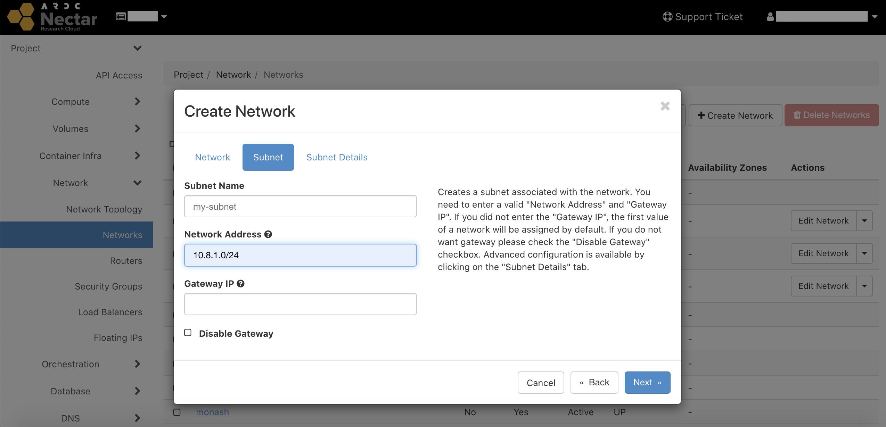
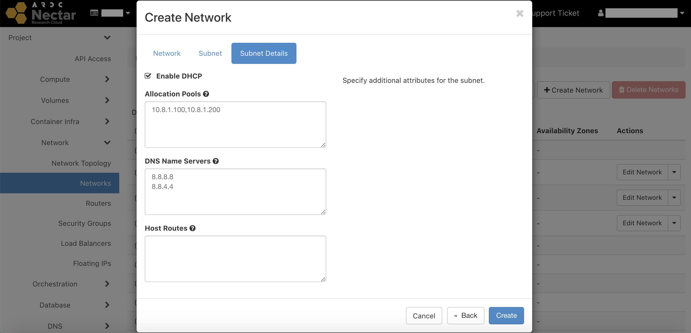
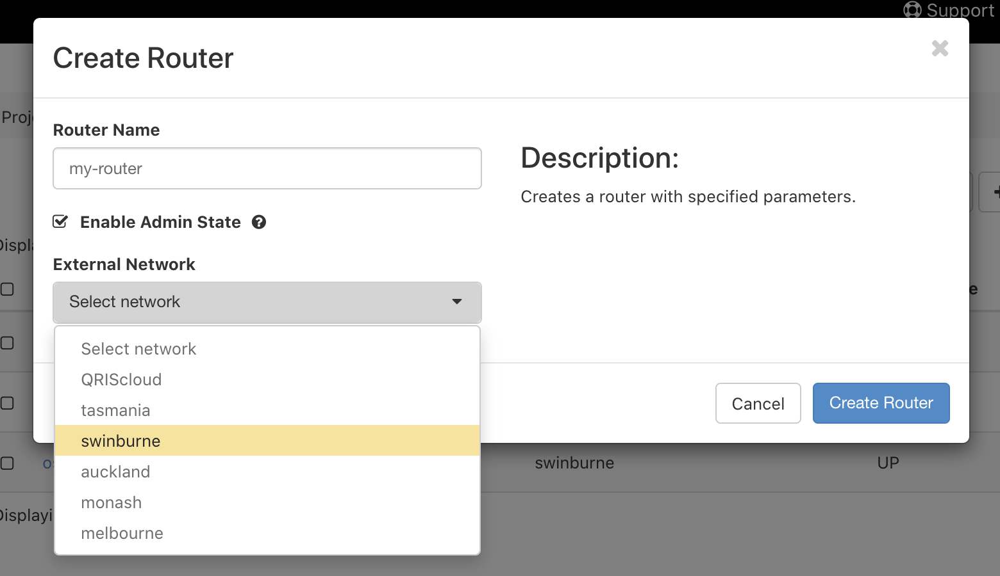
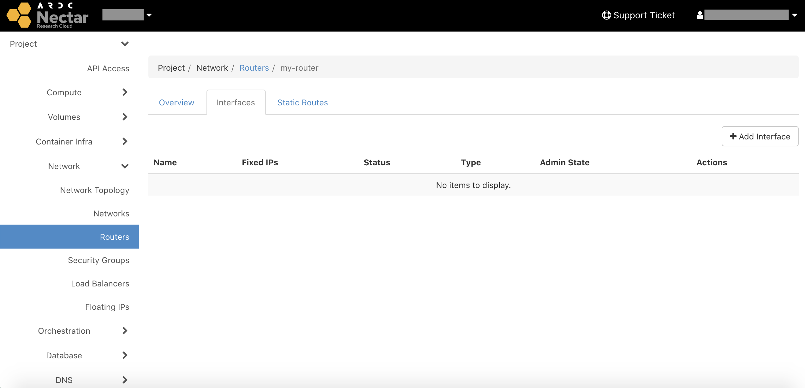
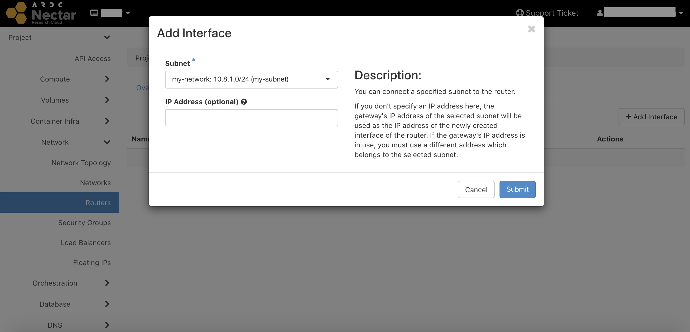
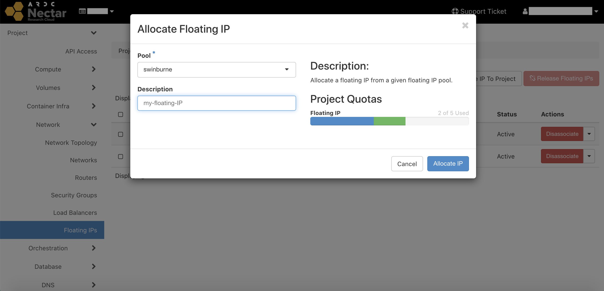
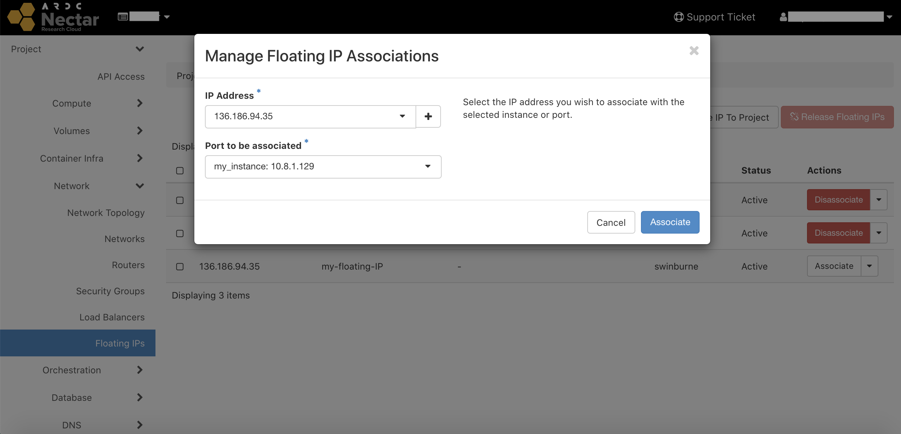

# Networks
When launching an instance, you have the choice to attach it to a classic network or to an advanced network that you have previously set up, or both.
Advanced networking is not automatically granted to new projects; you will need to request advanced networking quota for your project.

## Classic vs Advanced Networking
#### Classic Networking

By default, compute instances are assigned a fixed IP address and are connected directly to the internet via a public network located at the instance’s availability zone. In our case, the network is called `swinburne-01-public`.

#### Advanced Networking
If you have Advanced Networking quota, you can create your compute instances in a private network with a virtual router. The router is connected to the internet via a public IP address. Internet traffic can flow from the private network through the router to the public internet.

This is similar to most home network setups, and allows all the instances on the private network to use the same public IP to communicate with the internet. Communication between instances is also more secure as it can happen over the private network, while exposure to the public internet is determined by the router/network's settings. Each private network can contain multiple private subnets.

## Create a network
To create a network, go to `Project > Network > Networks` on the dashboard, and then select `+ Create Network`.

Give your network a name, and then click `Next` to create a subnet inside the network.

Give your subnet a name, and then choose a range of network addresses for your subnet using [CIDR notation](https://en.wikipedia.org/wiki/Classless_Inter-Domain_Routing#CIDR_notation){target="_blank"}, for example `10.8.1.0/24`.
Some other common CIDR ranges for private networks are,

- `10.0.0.0/8`
- `172.16.0.0/12`
- `192.168.0.0/16`

You can leave the gateway IP address field blank and it will be automatically set as the first IP address in the range. In our case the gateway IP will be `10.8.1.1`.

You may also choose to not have a gateway, in which case you won't be able to attach a router and configure access to the external internet.

Click next to configure your subnet's gateway.

Make sure `Enable DHCP` is selected if you want IP addresses to be automatically allocated to devices as they connect to the network. Below this, you can choose a subset of IP addresses for the allocation pool, or if you leave it blank the whole CIDR range of the subnet will be allowed (except the first address, which is the gateway, and the last address, which is the broadcast address).

By default, the Google DNS servers are automatically used, but you may add other ones.

Click `Create` to finish making your network + subnet. You should now see it listed among all the other networks available to your project.

At this point you could launch instances with this network, however they would not have inbound or outbound internet access.

## Create a router
Advanced Networking supports the creation of virtual routers that enable network traffic to be directed outside of the private network. Routers can be attached to an external network. When attached to an external network, the router can provide attached private networks with public internet access via SNAT. In this way, multiple VMs can use the same IP address to communicate with the outside world, saving precious public IP resources.

Note that **without a router attached to an external network**, your private network will not be able to communicate with the OpenStack metadata service (169.254.169.254) during instance boot. This is required for official Nectar and ADACS images, which connect to the metadata service through [Cloud-init](https://cloudinit.readthedocs.io/en/latest/){target="_blank"} in order to inject your ssh-key and initialise your VM.

To create a virtual router, go to `Project > Network > Routers` on the dashboard, and then select `+ Create Router`.

Give your router a name, select `swinburne` as the external network, and click `Create Router`.
It should now appear in the routers menu. Click on your router and then select the interfaces tab.

Then select `+ Add Interface`, select your network from the dropdown box, and click `Submit`.

Now when you launch an instance with this network, it will have access to the outside internet, and thus be able to access the OpenStack metadata service on boot to inject your SSH key and determine its own hostname.

Note, however, that your instance will still not be accessible from the internet, as it does not have a public IP address.

## Floating IP
Advanced networking also allows the use of Floating IP addresses. Floating IP addresses are IP addresses dedicated to a project (subject to quota allowance) and can be attached to an instance that is part of a private network in order to create a public presence for that instance. Because Floating IP addresses are dedicated to a project, it makes it possible to maintain a public IP address for an instance after termination.

You will need this in order to provide **a way in** to your instances that are on a private network. A router with an external network on its own will only provide **outbound** access.

To reserve a floating IP for your project, go to `Projet > Network > Floating IPs` on the dashboard, and then select `+ Allocate IP To Project`.

Select `swinburne` from the dropdown menu for the allocation pool, optionally give your IP a description, and click `Allocate IP`. You should see the address you've been allocated under `Project > Network > Floating IPs`.

Next, you need to associate your floating IP with an instance on an advanced network. Select `Associate` next to your floating IP, select your instance from the second dropdown menu, and click `Associate`.

Your instance on the private network is now accessible via this IP address.
