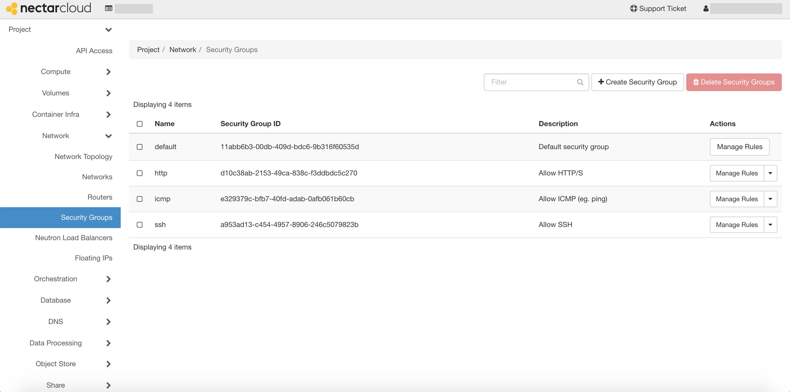
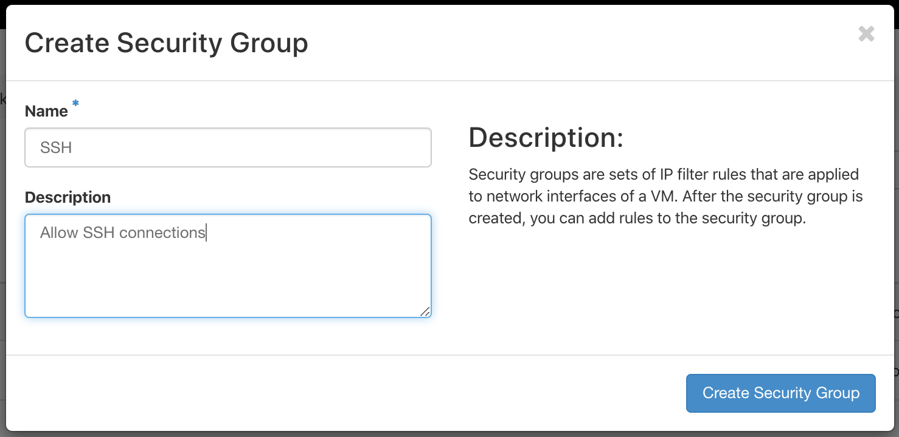
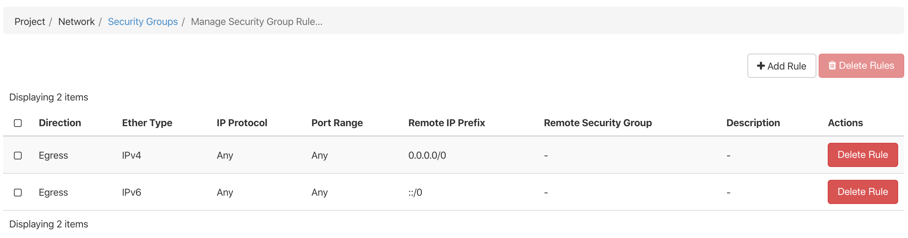
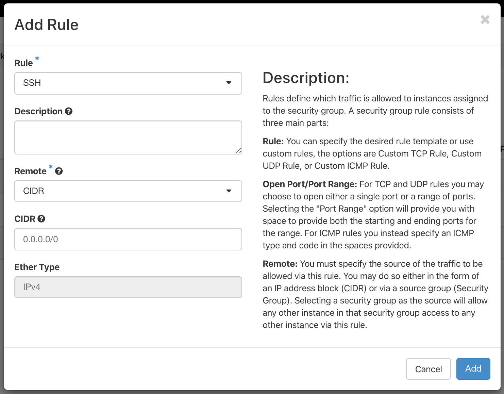

# Security Groups

!!! note
    All incoming network traffic is blocked by default. In order to access you instance, you must apply a security group that allows SSH connections.

An SSH security group should already exist in your trial project. To check that it is there, click the `Network` tab on the left panel, and then select `Security Groups`.

You should see several items, including one named `ssh` with the description `Allow SSH`.

If you do **not** see this, follow the instructions below to create a new security group that allows SSH connections.

### Creating a new security group
Select `+ Create Security Group`. You will now be prompted to give your security group a name and description. Let's name it `SSH` with the description `Allow SSH connections`, and then click the 'create security group' button.

You'll notice that it already contains two rules. These allow outgoing (egress) network traffic i.e. they allow your instance to communicate to the internet.

We'll create a new rule which will also allow some incoming (ingress) network traffic.

Click the `+ Add Rule` button, then select `SSH` from the dropdown menu under `Rule`. You can give the rule a description, but we'll accept the defaults for the rest of the options, and then click `Add` to create the new rule.

!!! note
    Setting `CIDR` (Classless Inter-Domain Routing) to `0.0.0.0/0` simply means that we allow connections from *any* IPv4 address.
