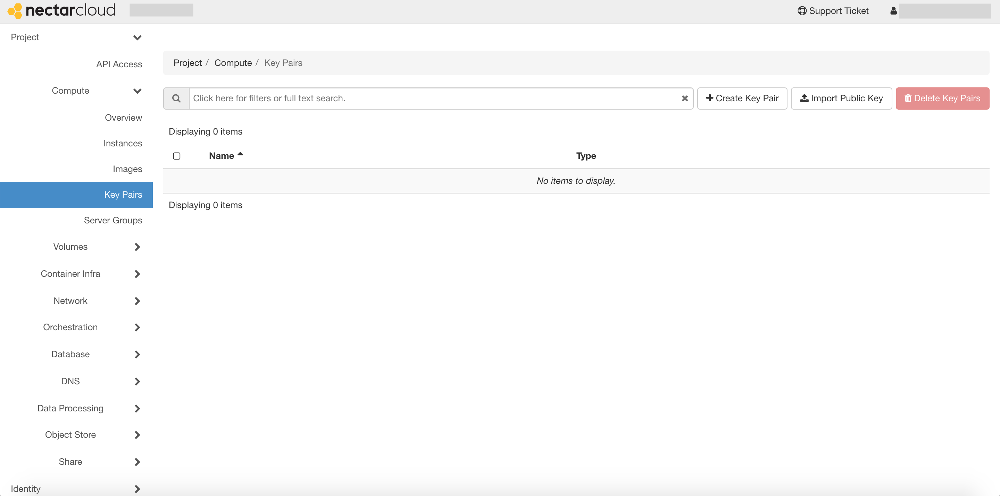
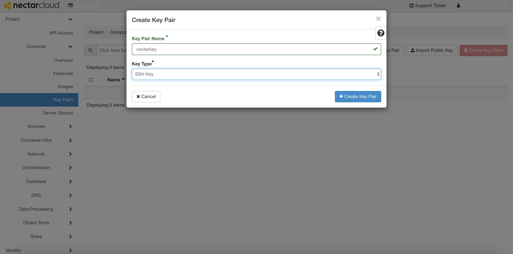

# Setting an SSH key
Click the `Compute` tab on the left panel, and then select `Key Pairs`.



You can either:

1. create a new SSH key pair; or
2. import an existing public key on your local machine

Let's go through creating a new key-pair first.
Press `+ Create Key Pair`. Give your key a name and select SSH Key for the Key Type. Then press the `Create Key Pair` button.



This will download a private key to your downloads folder with the suffix `.pem`.

It is good practice to store the key in the `~/.ssh` directory. Open a terminal and type

```console
mv ~/Downloads/nectarkey.pem ~/.ssh/.
```

to move the key, and change its permissions to be more secure by typing

```console
chmod 600 ~/.ssh/nectarkey.pem
```

**Alternatively**, if you already have a public key on your local machine that you wish to use, you can import it by pressing `Import Public Key`.
Give the key a name, select SSH Key as the key type and either paste the public key in the text box or click choose file and select it in the file manager.

**SECURITY WARNING:** make sure you are copying your PUBLIC key (should have the extension `.pub`) and not your PRIVATE key!

(For a detailed explanation of key-pair authentication for the Nectar research cloud, see the [SSH key tutorial page](http://training.nectar.org.au/package07/sections/createSSHKey.html)).