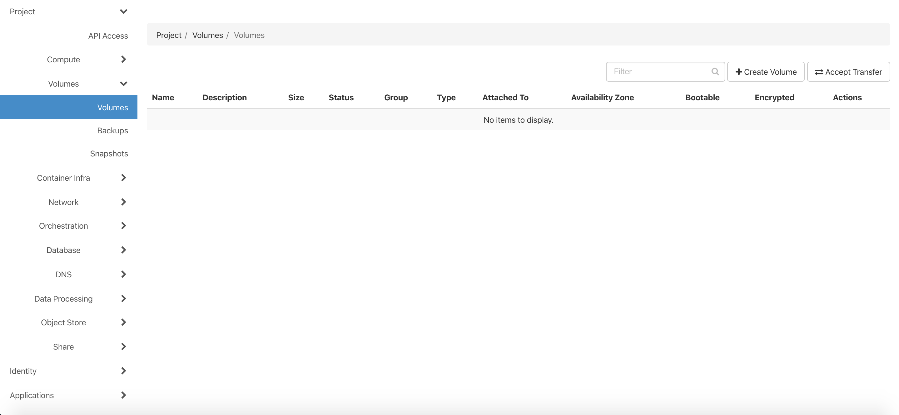
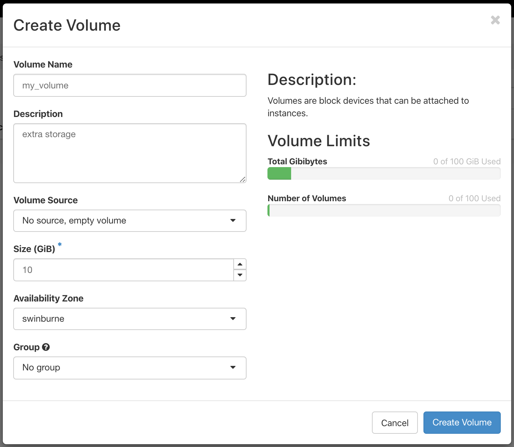
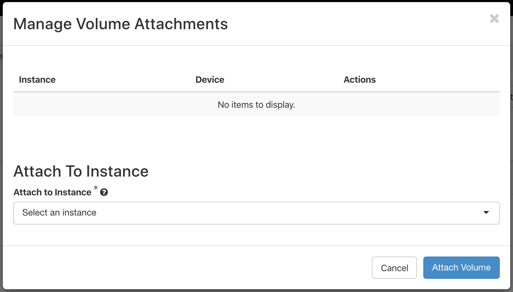

# Volumes
Depening on your computing needs, the storage/disk space that is included in your instance may not be enough (e.g. `10GB` with `t3.small` flavour).

Volumes are extra storage that you can add to your instance, which are persistent. In other words, data saved to the volume is not destroyed when you delete the instance it was attached to. It can also be attached to your virtual machine at any point.

### Creating a volume

!!! note
    Trial projects do **not** allow for any volumes by default. You must request to increase your quota, or join a project that has a non-zero quota for volumes before you can continue.

To create a new volume, select `Volumes > Volumes` from the left panel on your dashboard, then press the `+ Create Volume` button.



Specify a name and size for your volume, and make sure you pick the same availability zone that you instance is on.

!!! note "Important"
    You cannot attach a volume to an instance if their availability zones do not match.



### Attaching a volume
Now that you've created a volume, you need to attach it to your instance.

On the `Volumes > Volumes` page, click the drop-down arrow next to your volume and select `Manage Attachments`.


Then select the instance you would like to attach the volume to, and click the `Attach Volume` button.



The volume should now be visible on your instance.

### Creating a filesystem
Since we created an *empty* volume, we cannot write anything to it just yet because it doesn't have a *filesystem*.

To create a *filesystem* on your volume, log into your virtual machine and type
```console
lsblk
```
This lists all the *block devices* on your machine

```console
NAME   MAJ:MIN RM SIZE RO TYPE MOUNTPOINT
vda    252:0    0  30G  0 disk
└─vda1 252:1    0  30G  0 part /
vdb    252:16   0  10G  0 disk

```

The first one, `vda`, is the root disk that is provided by the instance flavour. It has one partition, called `vda1`, which is mounted at `/` i.e. the root of the filesystem.

The other disk, `vdb`, is the new volume that we just attached, and has no partitions mounted. We will make an `ext4` type filesystem on the device with the `mkfs` command (short for make filesystem). This command typically requires superuser privileges (sudo), so type

```console
sudo mkfs -t ext4 /dev/vdb
```

which should produce the output

```
mke2fs 1.44.1 (24-Mar-2018)
Creating filesystem with 2621440 4k blocks and 655360 inodes
Filesystem UUID: 002b0e9f-77d7-44ec-aca0-a0c86e364bcc
Superblock backups stored on blocks:
	32768, 98304, 163840, 229376, 294912, 819200, 884736, 1605632

Allocating group tables: done
Writing inode tables: done
Creating journal (16384 blocks): done
Writing superblocks and filesystem accounting information: done
```

!!! note
    We have not created the filesystem on a *partition* on the disk. This is partly because we intend to utilise the disk as a whole, and partly to keep this guide as simple as possible by avoiding going through the process of creating a partition. However, it is generally recommended to create a partition even if you are using the disk as a whole.

### Mounting
Next, we need to mount the disk to a directory so that we can read/write to it.
You can choose to mount it wherever you like, but it's good practice to mount it in `/mnt`, ideally in a new subdirectory, in case you want to mount multiple devices.

Let's create a new subdirectory within `/mnt` called `my_volume`

```console
sudo mkdir /mnt/my_volume
```

Now we can mount the device `/dev/vdb` at the *mount point* `/mnt/my_volume` with the command

```console
sudo mount /dev/vdb /mnt/data
```

If you list the devices again with `lsblk`, you will see that it is mounted.
You can also see more information about your device with the `df` tool. Type the command

```console
df -h /mnt/my_volume
```
and you should see something like
```console
Filesystem      Size  Used Avail Use% Mounted on
/dev/vdb        9.8G   37M  9.3G   1% /mnt/my_volume
```

Finally, you can change the ownership of the mount point to be the current `$USER`

```console
sudo chown $USER /mnt/my_volume
```

If you don't do this, then it is owned by `root`, and you will need to prefix `sudo` to every command that will write to the filesystem.

### Unmounting
To disconnect your volume from the VM, it is recommended you unmount it first before detaching. You can unmount the mount point
```console
sudo umount /mnt/my_volume
```
or, to the same effect, you can unmount the device
```console
sudo umount /dev/vdb
```
Then detach the volume via the dashboard on the `Volumes > Volumes` page.

!!! note
    The command is `umount` not `unmount`.

### Labels
To give your volume a name that is consistent regardless of where it is attached, and regardless of what else is connected, you can give it a label with the `e2label` command. For example, to give the volume currently attached to `/dev/vdb` the label `storage`, type

```console
sudo e2label /dev/vdb storage
```

To confirm it worked, you can use `lsblk --fs`, which displays the labels of all devices on your machine (typically blank by default).

You can now refer to this volume by its label `storage` when mounting

```console
sudo mount -L storage /mnt/my_volume
```

This is useful when connecting your volume to another machine where the attach point might be different (e.g. `/dev/vdc`, because a different volume is already attached to `/dev/vdb`). It's also useful to help distinguish volumes, particularly when they're the same size.

### Auto mounting
Whenever your machine is rebooted you will have to manually remount your volume, unless you set up auto mounting by making an entry in `/etc/fstab`.

For this you'll need either the **label** or the **UUID** of your volume. You can check what they are with `lsblk --fs`.
You'll also need to edit the fstab file in sudo mode, e.g.

```console
sudo nano /etc/fstab
```

The entry must be in the format
```console
<file system>   <mount point>    <type>  <options>       <dump>  <pass>
```

If you've labelled your volume, add this line to the bottom of the file
```console
LABEL=storage   /mnt/my_volume   ext4    defaults,nofail  0       2
```
Alternatively, you can refer to the file system with `UUID=`.

To make sure the new entry is valid and to mount the device (if it hasn't been mounted already) type `sudo mount -a`. You shouldn't see any output if everything is in order.

!!! seealso "See also"
    For more details, see the fstab manual page by typing `man fstab`.
